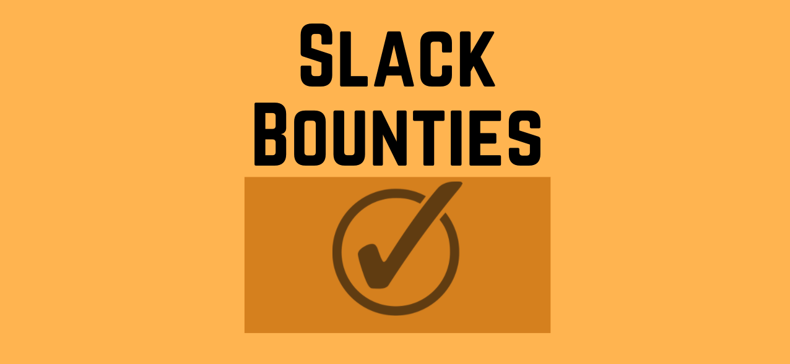
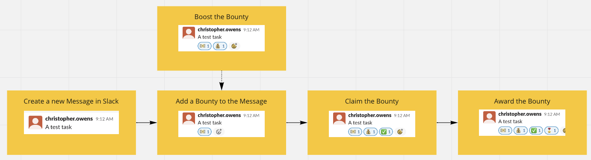
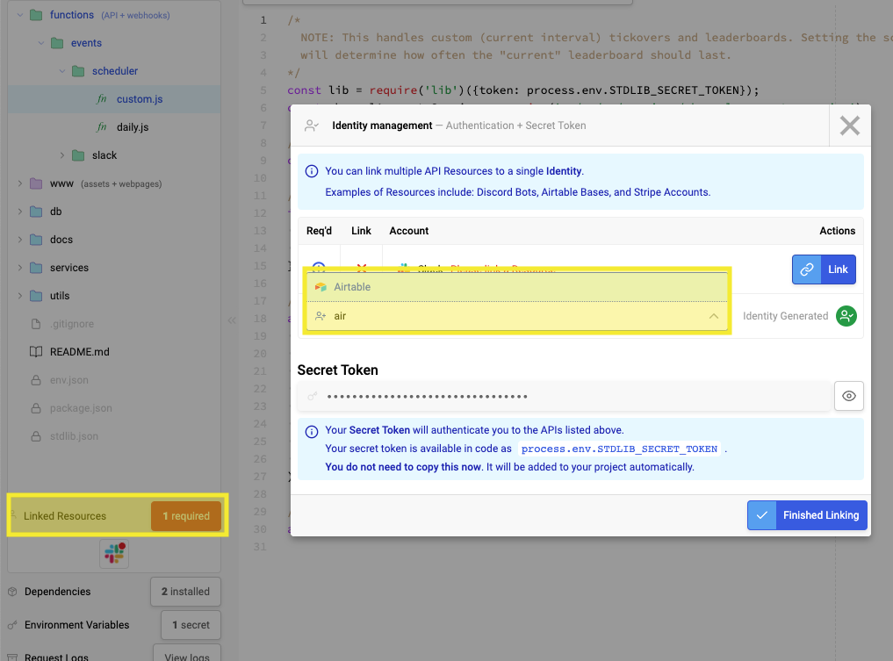
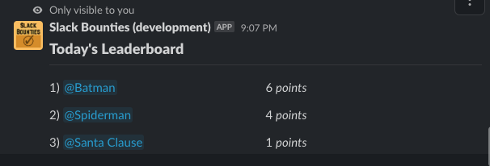
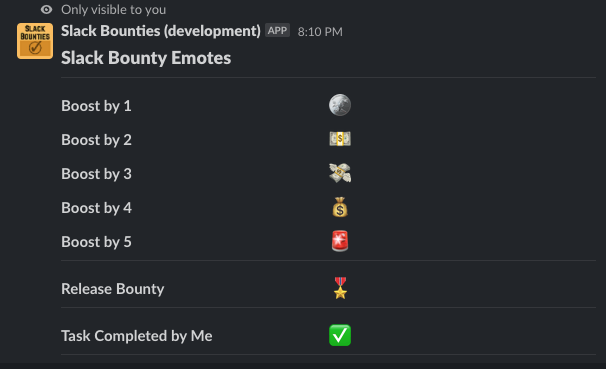
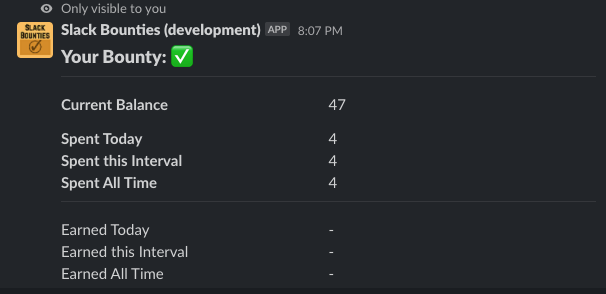
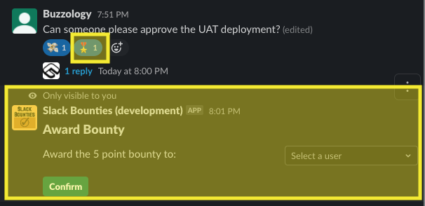
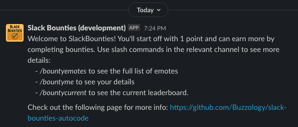
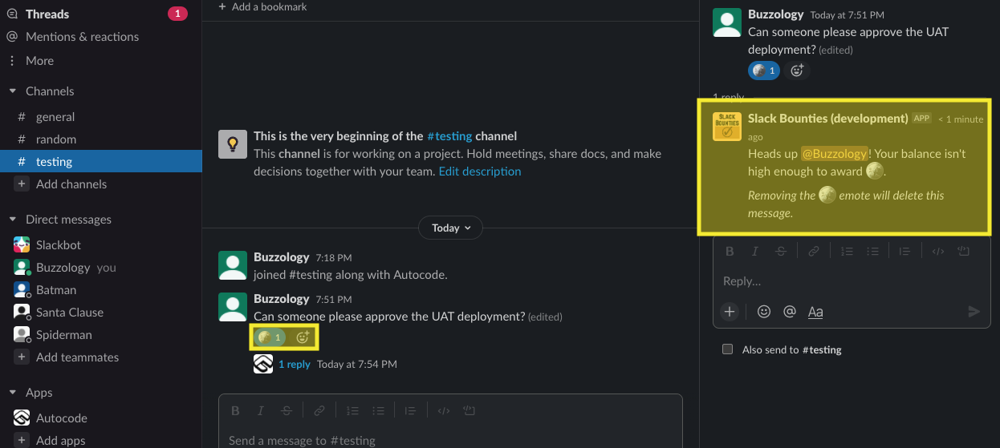

# What is it?
SlackBounties is a Slack bot that aims to improve task based processes through gamification. Users are given the ability to offer _bounties_ on their tasks which are then awarded to the completer.
While it was originally developed to improve the cross-team code review process at larger organisations it is likely suitable for most informal task workflows.

## Sample scenarios
This is a fairly typical flow for how the bounty process works.
- Christopher creates a new task message
- Christopher adds a bounty of 1 using the :cash: emote
- Someone else optionally  boosts the bounty by three using the :money_bag: emote
- Once the task is complete, the completer requests to claim the bounty using the :check: emote
  - Note that this step can be skipped by using the 'Award a Bounty' interaction described further below
- Christopher awards the bounty using the :medal: emote
  - Note that the `Award a Bounty` interaction can also be used for this step

### Boosting a bounty
- Chris has a large MR and he needs to get it reviewed
- He posts the MR in the code review channel and offers a bounty of 1 by adding a :cash: emote to the message
  - His balance is reduced by 1
- Nobody is in a hurry to review his MR as it's large and there's only a small bounty
- Andrew also wants this MR to go out ASAP so he boosts it by adding a :money_bag: emote
  - Andrew's balance is reduced by 3 and the bounty on the message is increased to 4
- Alex sees the new bounty and decides that it's probably worth doing for the 4 points, he reviews it and adds the :tick: emote
- Chris awards the bounty by adding the :medal: emote

### Earning points
- Chris posts his MR to the code-review channel but doesn't have enough points to add a bounty
- In order to get some points for his own MR Chris reviews Daniel's MR which has a bounty of 3 points
- Once Chris has finished reviewing the MR he adds the :check: emote
- Daniel awards Chris the bounty with the :medal: emote
- Chris uses the :money_with_wings: emote to add a 2 point bounty to his MR

## Where to see it?
There is currently a prototype setup in a new slack. You can join using the following link: https://join.slack.com/t/slackbounties-euk5448/shared_invite/zt-11lx95wpd-cij_O1ojJLnVMGrdQCo8DQ

## Setup 
While you won't need to do any coding to get this running, there are a few small steps required:
1) To get started, copy the airtable base using the following link: [Create Airtable Base](https://airtable.com/addBaseFromShare/shrE1WztivrqZFlxS?utm_source=universe_copy&exploreApplicationId=expae7goZHQO0flw6)
2) Copy the repo into Autocode: 
3) Link the new airtable base and target slack:

If you get stuck or hit any issues please feel free to reach out!

## Slash commands
### Leaderboards
These slash commands show the current leaderboards for the channel. Note that in order to avoid anyone feeling uncomfortable we limit the number of users shown on the leaderboard. By default this is set to five, but can be changed via configuration.

There are a few options that can be used:

- /cmd bountydaily
- /cmd bountycurrent
- /cmd bountyalltime
- /cmd bountyconfig
- /cmd bountyemotes
- /cmd bountyme

### Emotes
The `/cmd bountyemotes` slash command is simply used as a refresher to help remind people how each of the emotes can be used.

### Me
The `/cmd bountyme` slash command is used to show the current user's stats in the channel. It's currently the main way for a user to keep an eye on their balance, earnings, etc.

### Award a bounty
A bounty is awarded when the message's initial creator adds a _:medal:_ reaction. They will be sent an ephemeral message
with a prompt to select a user. Once the user is submitted the bounty is awarded and the bounty closed.

## Background functionality
While most of the bot is driven through emotes and slash commands there are still a number of components that rely on background processing.

### Leaderboards
At the end of each interval (daily, custom) a leaderboard will automatically be posted to each channel using the
bot. These leaderboards are currently identical to those that are accessible via the slash commands except for the
fact that they are shown to the whole channel and not just the active user.

### Decay and income
On each daily reset a decay and income is applied to all accounts. The decay is used to prevent hoarding and
to ensure that there's a reason for people to remain active. The income is applied as a slight balance
increase immediately after the decay. The current configuration applies a decay of 2 and an income of 1
but these values are very likely to change as we get more feedback.

### Resets
Points that are spent and earned are tracked on a daily, custom (defaults to weekly) and all time basis. Resets
will be performed as each interval ticks over.

### Initial welcome message
When a user triggers account creation for the first time they'll receive a PM from the bot. The message simply gives a brief
overview and a configurable link to where they can find more info (default is the repo's readme).

### Removing public bot messages
When a user adds an emote incorrectly the bot may send a friendly public reminder asking them to remove it. In order to make this process more friendly we bind to the
"reaction_removed" event. This allows us to delete the message when the user has corrected the action.

## FAQ
### Can I still get reviews if I don't offer a bounty?
Yes. This bot doesn't interfere with existing processes. It is simply an optional layer on top.

### Is there any reporting or monitoring on those that aren't doing as many reviews?
No. We intentionally only record balances - individual transactions are not saved to the
database. Leaderboards are also limited to the top configured number of users (default of five).
Even with full access to the database only the user's latest daily, interval (defaults to weekly)
and all time balances are available. 

### Can the bot be used for anything other than merge/pull requests?
Definitely! MRs are what I needed it for but it can probably be used for most other generic slack based tasks as well.

### Can I lodge issues and feature requests?
Yep!

### How do I change the emotes?
These are currently setup under `utils\config.js`. I'll allow for them to be overridden with environment variables
down the track.

### How do I change the decay/income amount?
These values are currently defined in `utils\config.js`. Down the track you'll be able to use environment variables
to override them.
